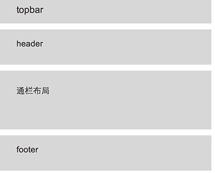

### 页面布局 layout

1. 页面布局，要求网页的布局结构保持一直，有一定的规律性，有规律可循，可扩展性高，易于维护;

2. 用于页面布局、重构的class作为类库或者框架的预定义的class保留下来，在拆分页面组件的时候，不得使用这些预留的class;

3. 这些预留的class，包括但不限于以下的class:topbar、header、footer、center、row、col*;

PC端网页常规的页面结构如下:

```html
<div class="container">
    <div class="header">header</div>
    <div class="center">
        <div class="row">
            <div class="col3">组件</div>
            <div class="col9">组件</div>
        </div>
    </div>
    <div class="footer">footer</div>
</div>
```

M站网页的基本页面布局结构如下:

```html
<div class="container">
    <div class="header">header</div>
    <div class="center">
        <div class="row">组件</div>
    </div>
    <div class="footer">footer</div>
</div>
```

PC端常见的布局结构如图:


M端网页的常规布局如下:



PC端网页和M站网页的布局结构的区别，就是少了分列、分栏部分的结构，因为M端网页的网页布局相对于PC结构要简单，很少甚至不会出现分栏的布局。
